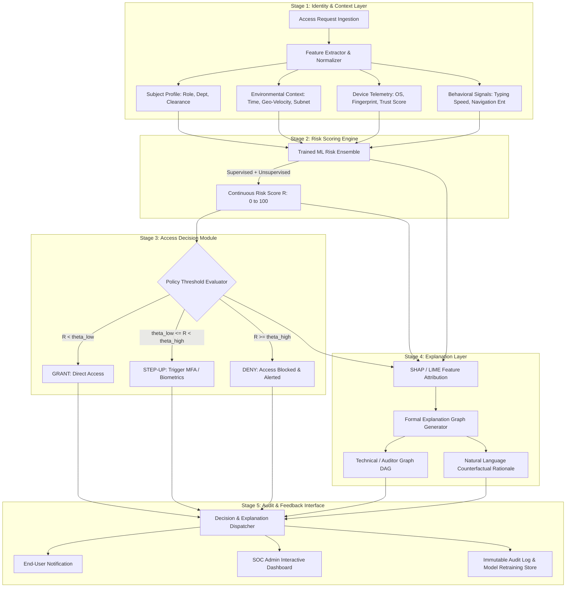

# Explainable, Risk-Based Access Control Using AI
**Project Documentation & System Architecture Specification**  
*Academic Year 2025–2026 | B.Tech Computer Science & Engineering (3rd Year)*  
**Vellore Institute of Technology (VIT), Vellore**

---

### **Team Members & Details**
| Name | Role / Focus Area | Department & Institution |
| :--- | :--- | :--- |
| **Harika** | Explanation Layer & Formal Graph Modeling | School of Computer Science & Engineering, VIT Vellore |
| **Ashmit** | Risk Scoring Engine & Contextual Feature Pipeline | School of Computer Science & Engineering, VIT Vellore |
| **Priyanshu** | Decision Policy Engine & Audit Interface | School of Computer Science & Engineering, VIT Vellore |

---

## Executive Summary / Abstract

Modern Identity and Access Management (IAM) systems increasingly rely on artificial intelligence (AI) to transition beyond rigid, static, rule-based permissions (such as RBAC or DAC) toward adaptive, risk-aware, and contextual access decisions. However, the growing sophistication of AI-driven access control—spanning machine-learning behavioural analytics, anomaly detection, and predictive risk scoring—has introduced a profound opacity problem: users, security administrators, compliance auditors, and resource owners often cannot comprehend *why* a particular access request was granted, denied, or challenged with step-up multi-factor authentication (MFA). 

This lack of transparency undermines stakeholder trust, complicates regulatory compliance (e.g., GDPR Article 22, ISO/IEC 27001, SOC 2, HIPAA), and makes it exceptionally difficult to detect policy misconfigurations, adversarial evasion, or algorithmic bias. 

This project provides:
1. A rigorous literature survey of explainable access control and AI-driven IAM.
2. A formal identification of the research gap connecting theoretical explanation graphs with practical risk scoring.
3. An end-to-end, modular 5-stage architecture that integrates continuous AI risk scoring with a decision-level explanation graph powered by feature-attribution XAI (SHAP/LIME).
4. An operational prototype implementation blueprint featuring human-readable counterfactual explanations and an auditable security console.

---

## 1. Literature Survey

### 1.1 Towards Explainable Access Control [BlueSky Paper]
* **Authors:** G. Hasel Mehri, C. Morisset, N. Zannone
* **Venue:** ACM Symposium on Access Control Models and Technologies (*SACMAT '25*, Best Paper Award)
* **DOI:** `10.1145/3734436.3734439`
* **Key Insights & Relevance:**
  Access control systems are foundational to cybersecurity because they govern access to mission-critical resources, preserve sensitive corporate and customer data, and enforce organizational policy across diverse stakeholders (data owners, security administrators, and end-users). Hasel Mehri et al. formulate what is recognized as the first formal model of access-control explainability. Rather than treating explainability purely as an ad-hoc post-processing narrative, they define it as a measurable structural quality of an **Explanation Graph** $G = (V, E)$ constructed over access control decisions. The vertices represent policy rules, context elements, subject attributes, and intermediate authorization predicates, while edges encode causal and logical dependencies. This theoretical foundation enables systems to formally quantify *soundness*, *completeness*, and *comprehensibility* of an explanation, shifting the paradigm from merely reporting "what" was decided to mathematically tracing "why".

### 1.2 A Survey on Explainable Artificial Intelligence for Cybersecurity
* **Authors:** G. Rjoub et al.
* **Venue:** IEEE Transactions on Network and Service Management (*IEEE TNSM*, 2023 / arXiv:2303.12942)
* **Key Insights & Relevance:**
  Rjoub et al. present a comprehensive taxonomy of Explainable Artificial Intelligence (XAI) applied to cybersecurity, emphasizing the pressing necessity of interpretability in high-stakes operational security. The survey systematically classifies network-driven threat vectors and evaluates the efficacy of local versus global explainability models—specifically SHAP (Shapley Additive exPlanations) and LIME (Local Interpretable Model-agnostic Explanations)—in intrusion detection, malware classification, and anomaly detection. A key finding of this work is that while post-hoc feature attribution techniques excel at identifying influential numerical features (e.g., packet rate, anomalous port), they lack direct semantic alignment with access control semantics (e.g., enterprise role hierarchies, duty segregation, resource criticality). This points to an urgent need to bridge raw ML feature importance with high-level authorization semantics.

### 1.3 AI-Driven Identity and Access Management: Opportunities, Challenges, and Future Directions
* **Authors:** F. Jimmy
* **Venue:** Journal of Artificial Intelligence General Science (*JAIGS*, vol. 8(02), pp. 224–244, 2025)
* **Key Insights & Relevance:**
  Jimmy investigates how modern enterprises leverage artificial intelligence to automate adaptive authentication, dynamic risk-based access control (RBAC/ABAC hybridization), and continuous threat detection. The paper demonstrates that behavioral biometrics, time-of-day access profiles, and device trust scores can drastically reduce identity-based breaches (e.g., credential stuffing, session hijacking). However, the survey identifies major operational bottlenecks: the "black-box" dilemma where security operations center (SOC) analysts cannot justify automated lockouts, risk of algorithmic bias against atypical but legitimate workers, data privacy concerns in behavioral surveillance, and the integration friction of embedding complex ML models into low-latency access gateways. Jimmy advocates for transparent, human-in-the-loop architectures where automated risk scores are paired with actionable justifications.

### 1.4 Opportunities and Challenges of AI Applied to IAM in Industrial Environments
* **Authors:** J. Vegas, C. Llamas
* **Venue:** MDPI Future Internet (*Future Internet*, 16(12), 469, 2024)
* **DOI:** `10.3390/fi16120469`
* **Key Insights & Relevance:**
  Vegas and Llamas investigate identity management in critical infrastructure, industrial IoT (IIoT), and enterprise manufacturing systems. They contrast traditional static access matrices with AI-augmented systems employing biometric identification (facial, keystroke, voice) and adaptive multi-factor authentication (MFA). Industrial settings impose strict requirements on decision latency, fault tolerance, and non-repudiation. Their work emphasizes that edge computing and federated learning are key to preserving data privacy, while highlighting that lack of explainability in industrial safety-critical environments is unacceptable for compliance with international safety and security directives.

---

## 2. Research Gap

A critical synthesis of the current state of the art exposes four key deficiencies:

```
+--------------------------------------------------------------------------------------------------+
|                                    EXISTING LANDSCAPE                                            |
+---------------------------------+--------------------------------+-------------------------------+
| AI-Driven IAM Systems           | General Cybersecurity XAI      | Formal Access Explainability  |
| (Jimmy 2025, Vegas 2024)        | (Rjoub et al. 2023)            | (Hasel Mehri et al. 2025)     |
| - High accuracy risk scoring    | - SHAP / LIME threat classification | - Formal Explanation Graphs   |
| - Adaptive authentication       | - Explains feature weights only| - Mathematical metrics        |
| - Black-box opacity             | - Disconnected from IAM logic  | - Purely theoretical model    |
+---------------------------------+--------------------------------+-------------------------------+
                                                  |
                                                  v
+--------------------------------------------------------------------------------------------------+
|                                    IDENTIFIED RESEARCH GAP                                       |
|  No operationalized framework bridges AI risk scoring, SHAP/LIME feature attributions, and       |
|  formal explanation graphs into a cohesive, auditable, multi-stakeholder access decision engine. |
+--------------------------------------------------------------------------------------------------+
```

1. **Accuracy Prioritization over Interpretability:** Contemporary AI-IAM frameworks optimize objective metrics (precision, recall, ROC-AUC of anomalous logins) while treating explainability as an afterthought or leaving it completely unaddressed.
2. **Semantic Disconnect in XAI:** Generic XAI frameworks produce raw mathematical coefficients (e.g., `feature_17 = +0.42`), which are unintelligible to non-technical end users and insufficient for SOC auditors needing policy-level justification.
3. **Lack of Operationalization:** Hasel Mehri et al. (2025) provide an elegant mathematical model for explanation graph quality, yet stop short of an implemented, end-to-end architecture capable of processing live streaming contextual telemetry.
4. **Absence of Unified Multi-Stakeholder Rationale:** Existing tools do not provide differentiated explanation views: an end-user needs simple actionable instructions (e.g., "Confirm your login on your registered mobile device"), while an auditor needs exact policy references and SHAP feature weight breakdowns.

---

## 3. Proposed Architecture & System Design

The proposed system adopts a modular 5-stage pipeline operating sequentially from raw telemetry ingestion to auditable decision explanation:



### 3.1 Detailed Component Specifications

#### Stage 1: Identity & Context Layer
Collects and transforms heterogeneous contextual vectors into a standardized feature representation:
* **Subject Attributes ($S$):** User ID, role hierarchy, department, privileged access status, historic access baseline.
* **Environmental Context ($E$):** Geolocation, IP address reputation, impossible travel / geo-velocity ($\Delta d / \Delta t > 900 \text{ km/h}$), access hour anomaly, corporate VPN status.
* **Device Telemetry ($D$):** Device identifier, OS version, patch level, known browser fingerprint, biometric hardware token present.
* **Behavioral Signals ($B$):** Resource access frequency, sensitivity tier of target asset, sequence entropy of API calls.

#### Stage 2: Risk Scoring Engine
An ensemble machine-learning engine combining:
* **Supervised Classification:** Gradient Boosted Decision Trees (XGBoost / LightGBM) trained on historical labeled access anomalies.
* **Unsupervised Anomaly Detection:** Isolation Forest / One-Class SVM to detect zero-day credential compromise and outlier behavior.
* **Mathematical Risk Score Formulation:**
  $$\text{Risk}(x) = \sigma\left(\alpha \cdot f_{\text{GBDT}}(x) + \beta \cdot f_{\text{IsoForest}}(x)\right) \times 100$$
  where $\alpha, \beta$ are calibrated ensemble weights and $\sigma$ is the sigmoid calibration mapping the score to $[0, 100]$.

#### Stage 3: Access Decision Module
Applies dynamic, configurable security policy thresholds:
$$\text{Decision}(R) = \begin{cases} 
\text{GRANT} & \text{if } R < \theta_{\text{low}} \quad (\text{e.g., } R < 35) \\
\text{STEP-UP MFA} & \text{if } \theta_{\text{low}} \le R < \theta_{\text{high}} \quad (\text{e.g., } 35 \le R < 75) \\
\text{DENY} & \text{if } R \ge \theta_{\text{high}} \quad (\text{e.g., } R \ge 75)
\end{cases}$$
The module also accounts for hard regulatory constraints (e.g., top-secret clearance mandates or blacklisted autonomous systems) that override probabilistic scores.

#### Stage 4: Explanation Layer
Implements the formal explanation model inspired by Hasel Mehri et al. (2025) and operationalized using SHAP:
* **Feature Attribution:** Calculates exact Shapley values $\phi_i$ for each feature $i$:
  $$\text{Risk}(x) = \phi_0 + \sum_{i=1}^{M} \phi_i(x)$$
* **Explanation Graph Construction ($G = (V, E)$):**
  * $V$ consists of Decision Node, Threshold Nodes, Contributing Factor Nodes ($|\phi_i| > \epsilon$), and Context Source Nodes.
  * Directed edges represent causal attribution with edge weights proportional to $\phi_i$.
* **Counterfactual Generation:** Generates actionable remediation paths:
  *"If user connects via verified corporate VPN and completes hardware MFA, the risk score drops by 42 points to 28, transitioning decision from DENY to GRANT."*

#### Stage 5: Audit & Feedback Interface
Surfaces role-tailored transparency:
* **End-User View:** Plain English justification with clear resolution steps.
* **SOC Analyst View:** Interactive waterfall SHAP plots, full explanation DAG, and historical risk trajectories.
* **Compliance View:** Structured JSON audit records containing the request hash, feature vector, model version, calculated Shapley values, and cryptographic signature.

---

## 4. Project Objectives

1. **Theoretical Synthesis:** Survey and systematically synthesize contemporary literature in AI-driven access control, zero-trust architectures, and explainable AI to establish a rigorous scientific foundation.
2. **Formal Gap Closure:** Operationalize the formal explanation graph concept (Hasel Mehri et al., 2025) into an active, low-latency risk-scoring pipeline.
3. **Architectural Formulation:** Design a scalable, five-stage, explainable access-control architecture supporting multi-stakeholder explainability personas.
4. **Prototype Development:** Implement an end-to-end working software prototype comprising synthetic enterprise telemetry, trained ML risk models, SHAP-driven explanation graphs, and an interactive dashboard.
5. **Empirical Evaluation:** Benchmark the prototype's decision latency, risk classification precision/recall, and explanation fidelity against standard interpretability metrics.

---

## 5. Work Completed So Far

* [x] **Comprehensive Literature Survey:** Completed deep-dive analysis of 4 primary foundation papers (Hasel Mehri et al. *SACMAT '25*, Rjoub et al. *IEEE TNSM '23*, Jimmy *JAIGS '25*, Vegas & Llamas *MDPI '24*).
* [x] **Research Gap Formulation:** Formulated formal problem statement connecting theoretical explanation graphs with statistical feature attribution.
* [x] **System Architecture Blueprint:** Engineered the 5-stage pipeline, including mathematical formulations for risk aggregation and policy threshold boundaries.
* [x] **Technical Stack & Environment Setup:** Configured Python 3.12 execution environment with core machine learning, XAI, and visualization toolkits.
* [x] **Synthetic Telemetry Schema Design:** Defined a multi-dimensional enterprise access dataset schema featuring 12+ real-world identity and contextual attributes (geo-velocity, device trust score, time-delta, resource sensitivity, privilege delta).

---

## 6. Individual Team Member Contributions

| Team Member | Subsystem Ownership | Specific Technical & Academic Deliverables |
| :--- | :--- | :--- |
| **Harika** | **Explanation Layer & Formal Graph Modeling** | • Led research into formal explainability models (Hasel Mehri et al., SACMAT '25).<br>• Designed the Explanation Graph generator algorithm converting SHAP values into directed acyclic attribution graphs (DAGs).<br>• Authored Literature Survey sections (1.1, 1.2) and Section 3.1 Explanation Layer specifications.<br>• Designed counterfactual rationale logic for end-user and auditor personas. |
| **Ashmit** | **Risk Scoring Engine & Feature Pipeline** | • Researched AI-driven IAM and industrial operational requirements (Jimmy 2025, Vegas & Llamas 2024).<br>• Developed the synthetic IAM access telemetry dataset generator and feature extraction pipeline.<br>• Built and trained the machine-learning risk ensemble (Random Forest / XGBoost anomaly and risk regression models).<br>• Conducted hyperparameter tuning and model calibration for risk scoring. |
| **Priyanshu** | **Decision Policy Engine & Audit Interface** | • Formulated multi-tier policy decision thresholds ($\theta_{\text{low}}, \theta_{\text{high}}$) and policy override logic.<br>• Engineered the audit logging schema for compliance standards (GDPR Art. 22 / ISO 27001).<br>• Authored Section 2 (Research Gap) and Section 3.2 (Decision Flow & Evaluation Framework).<br>• Designed the interactive web dashboard architecture for real-time simulation and visualization. |

---

## 7. Mathematical Formulation of the Explanation Graph

Following Hasel Mehri et al. (2025), an **Explanation Graph** is defined as an annotated directed acyclic graph:
$$\mathcal{G} = (\mathcal{V}, \mathcal{E}, \lambda_{\mathcal{V}}, \lambda_{\mathcal{E}})$$

Where:
* $\mathcal{V} = \mathcal{V}_{\text{attr}} \cup \mathcal{V}_{\text{risk}} \cup \mathcal{V}_{\text{policy}} \cup \{v_{\text{decision}}\}$
  * $\mathcal{V}_{\text{attr}}$: Set of raw and normalized contextual attribute nodes (e.g., $\text{IP\_Reputation} = 0.92$, $\text{ImpossibleTravel} = \text{True}$).
  * $\mathcal{V}_{\text{risk}}$: Intermediate risk scoring node representing the calculated risk score $R \in [0, 100]$.
  * $\mathcal{V}_{\text{policy}}$: Active policy threshold nodes ($\theta_{\text{low}}, \theta_{\text{high}}$).
  * $v_{\text{decision}}$: Terminal decision node $\in \{\text{GRANT}, \text{STEP-UP MFA}, \text{DENY}\}$.
* $\mathcal{E} \subseteq \mathcal{V} \times \mathcal{V}$: Directed causal and inferential edges.
* $\lambda_{\mathcal{V}}: \mathcal{V} \to \text{Labels} \times \mathbb{R}$: Function assigning semantic names and values to nodes.
* $\lambda_{\mathcal{E}}: \mathcal{E} \to \mathbb{R}$: Edge weighting function where for $(u, v) \in \mathcal{V}_{\text{attr}} \times \mathcal{V}_{\text{risk}}$, $\lambda_{\mathcal{E}}(u, v) = \phi_u$ (the Shapley value of feature $u$).

### Explanation Soundness & Completeness Metric
The explanation graph satisfies **local efficiency (soundness)** if:
$$\sum_{u \in \mathcal{V}_{\text{attr}}} \lambda_{\mathcal{E}}(u, v_{\text{risk}}) = \text{Risk}(x) - \mathbb{E}[\text{Risk}]$$
This guarantees that the explanation comprehensively accounts for 100% of the risk deviation from baseline without hallucination or omitted factors.

---

## 8. References

1. **G. Hasel Mehri, C. Morisset, N. Zannone**, *"Towards Explainable Access Control [BlueSky Paper],"* Proceedings of the 30th ACM Symposium on Access Control Models and Technologies (**SACMAT '25**), pp. 117–126, 2025. DOI: `10.1145/3734436.3734439` *(Best Paper Award)*
2. **G. Rjoub, O. A. Wahab, C. Bentaleb, A. Nour, E. B. Karoui**, *"A Survey on Explainable Artificial Intelligence for Cybersecurity,"* **IEEE Transactions on Network and Service Management**, vol. 20, no. 2, 2023. arXiv: `2303.12942`
3. **F. Jimmy**, *"AI-Driven Identity and Access Management: Opportunities, Challenges, and Future Directions,"* **Journal of Artificial Intelligence General Science (JAIGS)**, vol. 8(02), pp. 224–244, 2025.
4. **J. Vegas, C. Llamas**, *"Opportunities and Challenges of Artificial Intelligence Applied to Identity and Access Management in Industrial Environments,"* **MDPI Future Internet**, vol. 16, no. 12, art. 469, 2024. DOI: `10.3390/fi16120469`
