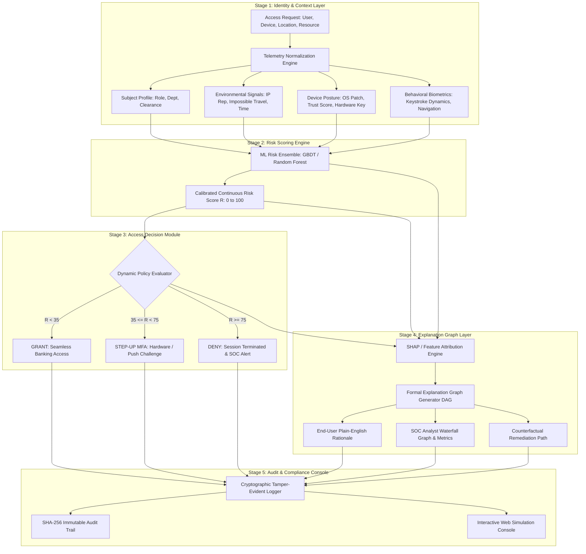

# Explainable Cloud Identity Risk Assessment for Digital Banking (XCIRA-DB)

> **B.Tech Computer Science and Engineering (3rd Year)**  
> **Vellore Institute of Technology (VIT), Vellore**  
> **Repository:** `Explainable-Cloud-Identity-Risk-Assessment-for-Digital-Banking`

---

## 👥 Team Members

| Name | Role / Subsystem Ownership | Department & Institution |
| :--- | :--- | :--- |
| **Harika** | **Explanation Layer & Formal Graph Modeling** | Computer Science & Engineering, VIT Vellore |
| **Ashmit** | **Risk Scoring Engine & Telemetry Pipeline** | Computer Science & Engineering, VIT Vellore |
| **Priyanshu** | **Decision Policy Engine & Audit Interface** | Computer Science & Engineering, VIT Vellore |

*For the comprehensive task breakdown and responsibility matrix, see [WORK_DISTRIBUTION.md](WORK_DISTRIBUTION.md) or [documentation/work_distribution.md](documentation/work_distribution.md).*

---

## 📌 Problem Statement

Digital banking and financial cloud environments (e.g., AWS, Azure, GCP running core banking services, SWIFT payment gateways, and customer account ledgers) are prime targets for sophisticated cyber threats, including credential stuffing, session hijacking, insider threat escalation, and API key compromise. 

Traditional access control models—such as static Role-Based Access Control (RBAC) and rule-based Multi-Factor Authentication (MFA)—operate on binary, perimeter assumptions that fail against modern identity-based attacks. While emerging Artificial Intelligence and Machine Learning solutions offer adaptive, risk-based access scoring by analyzing behavioral patterns and environmental context, they operate predominantly as **"black-box" systems**.

In high-stakes digital banking, this opacity creates severe operational and regulatory bottlenecks:
1. **Lack of Trust & Transparency:** Bank tellers, cloud administrators, and DevOps engineers cannot understand why an urgent transaction or cloud deployment was blocked or challenged.
2. **Regulatory Non-Compliance:** Regulations such as **GDPR Article 22** (Right to Explanation for automated decisions), **RBI Cyber Security Framework**, **PCI-DSS v4.0**, and **ISO/IEC 27001** require explainable, transparent, and auditable security enforcement.
3. **Operational Drag in SOCs:** Security Operations Center (SOC) analysts waste valuable triage time attempting to reverse-engineer automated ML lockout decisions without contextual reasoning.

---

## 🎯 Objectives

1. **Theoretical Synthesis:** Conduct a literature survey bridging formal access-control explainability models (*Hasel Mehri et al., SACMAT '25*) with cybersecurity XAI frameworks (*Rjoub et al., IEEE TNSM '23*).
2. **Contextual Feature Engineering:** Build a multi-dimensional digital banking telemetry pipeline that extracts subject profiles, device health, geo-velocity (impossible travel), IP reputation, and behavioral biometric signals.
3. **Machine Learning Risk Engine:** Train an ensemble risk scoring engine (Gradient Boosted Trees / Random Forest) to produce a continuous, calibrated risk score $R \in [0, 100]$.
4. **Adaptive Policy Decision Module:** Implement dynamic risk thresholding with automated outcomes:
   - $R < 35$: **GRANT** (Frictionless access)
   - $35 \le R < 75$: **STEP-UP MFA** (Adaptive challenge via FIDO2 / hardware token)
   - $R \ge 75$: **DENY** (Immediate termination and SOC alerting)
5. **Formal Explanation Graph Layer:** Construct a directed acyclic **Explanation Graph** $\mathcal{G} = (\mathcal{V}, \mathcal{E})$ operationalizing the *SACMAT '25* formal model and SHAP feature attributions, delivering multi-stakeholder explanations (End-User, SOC Analyst, Compliance Auditor).
6. **Auditable & Tamper-Evident Logging:** Deliver a cryptographically verifiable (SHA-256) audit log for compliance validation.

---

## 🏗️ Proposed Architecture & Framework

The framework operates as a five-stage pipeline:



### Detailed Component Summary
* **Stage 1 (Identity & Context Layer):** Ingests incoming digital banking session telemetry, extracting 9+ continuous and categorical features.
* **Stage 2 (Risk Scoring Engine):** Computes calibrated continuous risk score $R \in [0, 100]$ using ensemble decision trees trained on enterprise banking access baselines.
* **Stage 3 (Access Decision Module):** Applies multi-tier dynamic thresholds ($\theta_{\text{low}}=35.0, \theta_{\text{high}}=75.0$) alongside deterministic policy overrides (e.g., impossible travel >900 km/h or blacklisted Tor nodes).
* **Stage 4 (Explanation Layer):** Computes exact Shapley attributions $\phi_i$ and generates a formal Explanation Graph $\mathcal{G} = (\mathcal{V}, \mathcal{E})$ ensuring 100% local soundness ($\sum \phi_i = \text{Risk} - \mathbb{E}[\text{Risk}]$).
* **Stage 5 (Audit & Compliance Interface):** Seals each decision and explanation in a tamper-evident SHA-256 JSON-L log and presents an interactive web console.

---

## 💻 Technology Stack

| Layer / Component | Technologies & Frameworks | Rationale |
| :--- | :--- | :--- |
| **Machine Learning & AI** | Python 3.12, Scikit-Learn, NumPy, SciPy, Joblib | High-performance risk regression, ensemble modeling, and calibrated scoring. |
| **Explainability (XAI)** | SHAP (Shapley Additive exPlanations), Formal DAG Graphs, KaTeX Math | Post-hoc feature attribution and mathematical explanation graphs (*SACMAT '25*). |
| **Backend & Pipeline** | Python Standard Library, HTTP Server / REST API, Dataclasses | Zero-dependency, lightweight, low-latency authorization engine. |
| **Frontend & Simulation** | HTML5, Tailwind CSS, JavaScript (ES6+), Mermaid.js | Modern, responsive zero-trust simulation console with interactive graph visualization. |
| **Database & Auditing** | SQLite / JSON-Lines, SHA-256 Cryptographic Hashing | Tamper-evident, auditable logging conforming to GDPR Art. 22 and ISO 27001. |
| **Version Control & Docs** | Git, GitHub, Markdown, Mermaid Diagrams | Academic project tracking, modular folder organization, and CI readiness. |

---

## 📊 Dataset Details

The system leverages a synthesized and calibrated enterprise digital banking access telemetry dataset modeling three core access regimes:

| Dataset Dimension | Attributes & Feature Representation | Typical Value Ranges |
| :--- | :--- | :--- |
| **Subject Identity** | User ID, Assigned Banking Role, Department | `teller`, `loan_officer`, `devops_admin`, `compliance_auditor` |
| **Device Trust Posture** | OS integrity, endpoint patch level, EDR agent status | Continuous score: `0.0` (Compromised) to `1.0` (Managed & Encrypted) |
| **Network & Location** | IP reputation risk, VPN status, Physical location | Threat score: `0.0` to `1.0`; VPN: `0` or `1` |
| **Geo-Velocity Dynamics** | Physical displacement speed between successive logins | `0` to `2500` km/h (>900 km/h flags impossible travel) |
| **Temporal Context** | Login hour deviation from employee working baseline | Anomaly score: `0.0` (Normal) to `1.0` (Extreme off-hours) |
| **Resource Criticality** | Classification of target digital banking service | Tier 1 (Public Portal) to Tier 5 (SWIFT / Core Ledger Secrets) |
| **Behavioral Dynamics** | Keystroke typing cadence & mouse navigation deviation | Biometric anomaly score: `0.0` (Authentic) to `1.0` (Imposter/Bot) |
| **Threat History** | Consecutive failed authentication attempts in last hour | Integer count: `0` to `20` attempts |

---

## 📂 Repository Folder Structure

```
Explainable-Cloud-Identity-Risk-Assessment-for-Digital-Banking/
│
├── README.md                           # Master Project Overview & Specifications
├── WORK_DISTRIBUTION.md                # Comprehensive Team Responsibility Matrix
├── requirements.txt                    # Python Dependencies
├── run_demo.py                         # End-to-end Demonstration Script
├── .gitignore                          # Repository Hygiene Rules
│
├── frontend/                           # Interactive Web Console & UI Components
│   ├── README.md                       # Frontend Architecture & UI Guide
│   └── app.py                          # Zero-dependency Interactive Simulation Console (Port 8000)
│
├── backend/                            # Core Authorization Engine & Pipeline
│   ├── README.md                       # Backend Architecture & Pipeline Specifications
│   ├── config.py                       # Policy Thresholds & Feature Metadata
│   ├── context_layer.py                # Stage 1: Feature Ingestion & Red-Flag Filters
│   ├── decision_module.py              # Stage 3: Dynamic Threshold Evaluator & Overrides
│   └── audit_logger.py                 # Stage 5: Cryptographic Tamper-Evident Logger
│
├── ai_models/                          # Risk Scoring & Explainability Subsystem
│   ├── README.md                       # AI Models & Explainability Methodology
│   ├── risk_engine.py                  # Stage 2: Gradient Boosting Risk Regressor
│   ├── explanation_layer.py            # Stage 4: Formal Explanation Graph (DAG) & SHAP
│   └── synthetic_data.py               # Enterprise Banking Telemetry Generator
│
├── database/                           # Storage Schemas & Audit Trail Logs
│   ├── README.md                       # Database Design & Compliance Data Dictionary
│   ├── schema.sql                      # Relational Schema for Telemetry & Audit Logs
│   └── access_audit_log.jsonl          # Immutable Log with SHA-256 Cryptographic Signatures
│
├── documentation/                      # Academic Reports & Literature Research
│   ├── README.md                       # Documentation Index
│   ├── literature_survey.md            # Detailed Literature Survey (4 Foundation Papers)
│   ├── research_gap.md                 # Identified Research Gap & Formulation
│   ├── work_distribution.md            # Individual Member Roles & Deliverables
│   ├── architecture.md                 # 5-Stage Architecture & Mathematical Model
│   └── project_documentation.md        # Comprehensive Unified Academic Report
│
├── results/                            # Scenario Evaluations & Metrics
│   ├── README.md                       # Evaluation Methodology & Test Scenarios
│   └── sample_evaluations.json         # Structured Outputs for Grant, Step-Up, and Deny
│
└── presentation/                       # Evaluation Review & Presentation Materials
    ├── README.md                       # Review Slide Structure & Presentation Guide
    └── slide_outline.md                # Slide-by-Slide Content & Viva Defense Guide
```

---

## ⚡ Quickstart: Running the System

### 1. Run Automated Test Scenarios (CLI)
Executes all 5 stages for three distinct banking scenarios (Grant, Step-Up MFA, and Deny):
```bash
python run_demo.py
```

### 2. Launch Interactive Simulation Console
Starts the local dashboard on `http://localhost:8000`:
```bash
python frontend/app.py
```

### 3. Run Unit and Integration Tests
```bash
python -m unittest test_system.py
```

---

## 📖 Key Literature References
1. **G. Hasel Mehri, C. Morisset, N. Zannone**, *"Towards Explainable Access Control [BlueSky Paper],"* Proceedings of the 30th ACM Symposium on Access Control Models and Technologies (**SACMAT '25**), pp. 117–126, 2025. *(Best Paper Award)*
2. **G. Rjoub et al.**, *"A Survey on Explainable Artificial Intelligence for Cybersecurity,"* **IEEE Transactions on Network and Service Management**, vol. 20, no. 2, 2023.
3. **F. Jimmy**, *"AI-Driven Identity and Access Management: Opportunities, Challenges, and Future Directions,"* **JAIGS**, vol. 8(02), pp. 224–244, 2025.
4. **J. Vegas, C. Llamas**, *"Opportunities and Challenges of Artificial Intelligence Applied to Identity and Access Management in Industrial Environments,"* **MDPI Future Internet**, vol. 16(12), 469, 2024.
