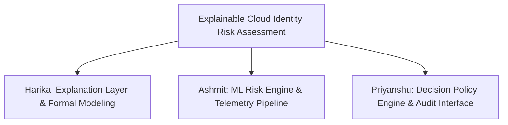

# Work Distribution & Responsibility Matrix
**Project Title:** Explainable Cloud Identity Risk Assessment for Digital Banking  
**Academic Year:** 2025–2026 | B.Tech CSE (3rd Year) | VIT Vellore  

---

## 👥 Overview of Team Allocation

The project is structured into three primary technical domains, each led by a designated team member:

---

## 📋 Detailed Responsibility Breakdown

### 1. Harika
* **Primary Role:** Explanation Layer Lead & Formal Graph Architect
* **Subsystems Owned:**
  * Formal Explanation Graph Generator (`ai_models/explanation_layer.py`)
  * Feature Attribution Integration (SHAP / LIME attribution adapters)
  * Multi-Stakeholder Narrative Synthesis (End-User, SOC Analyst, Counterfactual Remediation)
  * Academic Literature Survey on Explainable Access Control
* **Key Deliverables & Responsibilities:**
  1. Researched and operationalized the formal explanation graph model proposed by Hasel Mehri et al. (SACMAT '25, Best Paper Award).
  2. Designed the algorithm converting post-hoc Shapley values $\phi_i$ into directed acyclic attribution graphs (DAGs).
  3. Formulated the **local efficiency / explanation soundness metric** ($\sum \phi_i = \text{Risk} - \mathbb{E}[\text{Risk}]$) guaranteeing zero omitted risk factors.
  4. Authored documentation on Explainable AI for Cybersecurity (*documentation/literature_survey.md* - Sections 1.1 & 1.2).
  5. Implemented the dynamic Mermaid graph serialization used in the visual console.

---

### 2. Ashmit
* **Primary Role:** Machine Learning Lead & Telemetry Pipeline Engineer
* **Subsystems Owned:**
  * Cloud IAM Telemetry Generator (`ai_models/synthetic_data.py`)
  * Machine Learning Risk Scoring Engine (`ai_models/risk_engine.py`)
  * Feature Preprocessing & Vector Normalization
  * Model Calibration & Hyperparameter Tuning
* **Key Deliverables & Responsibilities:**
  1. Surveyed machine learning applications in modern Identity & Access Management (*Jimmy 2025*, *Vegas & Llamas 2024*).
  2. Engineered the 9-dimensional digital banking telemetry schema capturing subject identity, device health, IP reputation, impossible travel velocity, and behavioral biometrics.
  3. Developed the synthetic access telemetry dataset generator modeling three distinct behavioral regimes (routine low-risk, anomalous remote work, and credential-stuffing cyberattacks).
  4. Built and calibrated the Gradient Boosted Decision Tree (GBDT) risk scoring regressor outputting continuous risk scores $R \in [0, 100]$.
  5. Designed fallback calibration logic ensuring operational continuity across heterogeneous environments.

---

### 3. Priyanshu
* **Primary Role:** Policy Decision Lead & Compliance Interface Architect
* **Subsystems Owned:**
  * Identity & Context Extraction Layer (`backend/context_layer.py`)
  * Access Decision Module & Dynamic Thresholding (`backend/decision_module.py`)
  * Cryptographic Audit Logger (`backend/audit_logger.py`, `database/`)
  * Interactive Simulation Dashboard (`frontend/app.py`)
* **Key Deliverables & Responsibilities:**
  1. Formulated multi-tier dynamic access policy thresholds ($\theta_{\text{low}}=35.0$ for Grant, $\theta_{\text{high}}=75.0$ for Deny, with intermediate Step-Up MFA).
  2. Engineered deterministic security override filters (impossible travel velocity $>900\text{ km/h}$, blacklisted Tor exit nodes, and unauthorized high-sensitivity data access).
  3. Formulated the Research Gap and Problem Statement connecting theoretical models to real-world cloud banking operations (*documentation/research_gap.md*).
  4. Built the tamper-evident audit logging mechanism incorporating SHA-256 cryptographic signatures compliant with GDPR Article 22 and ISO/IEC 27001.
  5. Developed the interactive web simulation console supporting real-time slider updates, preset attack loading, and audit log inspection.

---

## 📊 Milestone & Phase Allocation

| Phase / Milestone | Harika | Ashmit | Priyanshu | Status |
| :--- | :--- | :--- | :--- | :--- |
| **Phase 1: Literature Survey & Gap Analysis** | Formal Explainability (SACMAT '25) & Cybersecurity XAI (IEEE TNSM) | AI in IAM (JAIGS '25) & Industrial IAM (MDPI '24) | Problem Statement & Regulatory Compliance Context | **Completed** |
| **Phase 2: Architecture & System Design** | Explanation Graph DAG Design & KaTeX Formulation | Feature Engineering & Telemetry Schema Design | 5-Stage Pipeline Blueprint & Policy Thresholds | **Completed** |
| **Phase 3: Prototype & Models** | SHAP Attribution & Graph Serializer | ML Risk Ensemble Training & Synthetic Data Gen | Dynamic Policy Engine & Instant Override Heuristics | **Completed** |
| **Phase 4: Interface & Auditing** | Stakeholder Narratives & Counterfactual Logic | Model Performance & Risk Score Calibration | Interactive Web Console & SHA-256 Audit Logger | **Completed** |
| **Phase 5: Evaluation & Review Defense** | Graph Soundness & Completeness Metrics | Risk Regression Evaluation & Confusion Matrix | Review Presentation Slide Deck & Viva Outline | **Ready** |
