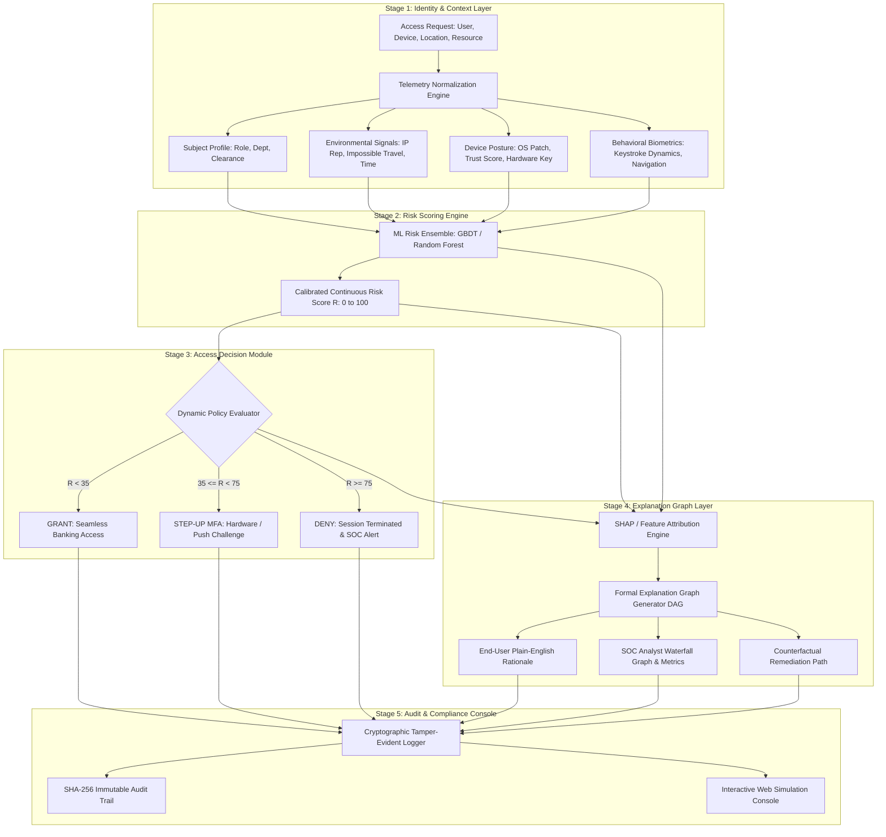

# System Architecture & Formal Mathematical Formulation

**Project:** Explainable Cloud Identity Risk Assessment for Digital Banking  
**Authors:** Harika, Ashmit, Priyanshu | 3rd Year CSE, VIT Vellore  

---

## 🏗️ 5-Stage Architecture Pipeline

---

## 📐 Formal Mathematical Framework

### 1. Risk Scoring & Calibration
Given an access request feature vector $x = [x_1, x_2, \dots, x_M]^T \in \mathbb{R}^M$, the ML risk ensemble predicts a raw continuous risk score $f(x)$. A monotonic calibration mapping bounds the output:
$$\text{Risk}(x) = \min\left(100.0, \, \max\left(0.0, \, f(x)\right)\right) \in [0, 100]$$

### 2. Dynamic Threshold Decision Policy
$$\text{Decision}(R, \text{Flags}) = \begin{cases}
\text{DENY} & \text{if } \text{ImpossibleTravel}(x) \lor \text{BlacklistIP}(x) \\
\text{GRANT} & \text{if } R < \theta_{\text{low}} \quad (\theta_{\text{low}} = 35.0) \\
\text{STEP-UP MFA} & \text{if } \theta_{\text{low}} \le R < \theta_{\text{high}} \quad (\theta_{\text{high}} = 75.0) \\
\text{DENY} & \text{if } R \ge \theta_{\text{high}}
\end{cases}$$

### 3. Explanation Graph Formulation (Hasel Mehri et al., SACMAT '25)
The **Explanation Graph** is defined as an annotated directed acyclic graph:
$$\mathcal{G} = (\mathcal{V}, \mathcal{E}, \lambda_{\mathcal{V}}, \lambda_{\mathcal{E}})$$

Where:
* $\mathcal{V} = \mathcal{V}_{\text{context}} \cup \mathcal{V}_{\text{risk}} \cup \mathcal{V}_{\text{policy}} \cup \{v_{\text{decision}}\}$
  * $\mathcal{V}_{\text{context}}$: Nodes representing observed contextual and biometric signals.
  * $\mathcal{V}_{\text{risk}}$: Node representing the predicted risk score $R \in [0, 100]$.
  * $\mathcal{V}_{\text{policy}}$: Active security policy rule nodes.
  * $v_{\text{decision}}$: Terminal decision node $\in \{\text{GRANT}, \text{STEP-UP MFA}, \text{DENY}\}$.
* $\mathcal{E} \subseteq \mathcal{V} \times \mathcal{V}$: Causal and evaluative directed edges.
* $\lambda_{\mathcal{E}}: \mathcal{E} \to \mathbb{R}$: Edge attribution weights where for $(u, v) \in \mathcal{V}_{\text{context}} \times \mathcal{V}_{\text{risk}}$, $\lambda_{\mathcal{E}}(u, v) = \phi_u$ (the Shapley attribution value of feature $u$).

### 4. Local Efficiency & Soundness Proof
An explanation is mathematically sound if the sum of edge attribution weights strictly accounts for the observed risk deviation from the expected baseline:
$$\sum_{u \in \mathcal{V}_{\text{context}}} \lambda_{\mathcal{E}}(u, v_{\text{risk}}) = \text{Risk}(x) - \mathbb{E}[\text{Risk}]$$
This guarantees **zero hallucination** and ensures that every point of elevated or mitigated risk is fully attributable to verifiable context attributes.
